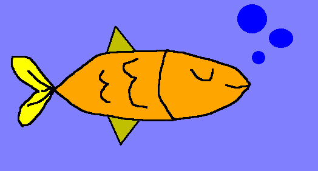
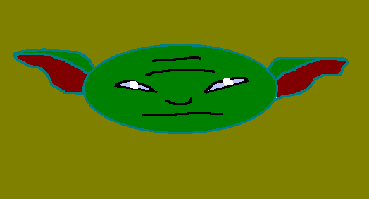

# PaintDotNET - A Minimalist Drawing App in *C#*

This is a drawing application we created during our time at university. Think of it as our own take on Microsoft Paint (but on a smaller scale), but with some cool programming concepts thrown in.

## Who Are We?

We're a team of 4 students from Faculty of Automatic Control and Computer Engineering:

- **Rareș-Ștefan Asaftei**
- **Robert-Constantin Grigoraș** 
- **George-Cristian Slabu**
- **Alexandru Vezeteu**


## What We Built

So basically, we wanted to create a drawing app that doesn't suck. You know how sometimes simple software can be really frustrating to use? We tried to avoid that. Our app lets you:

- Draw with different tools (pencil, shapes, lines)
- Pick colors from a palette or use a fancy color picker
- Save your masterpieces in different formats
- Actually undo your mistakes (this was the tricky part!)

If you want to check out some simple drawings, we have a separate folder with the documentation that contains them, so feel free to have a look!

## The Cool Technical Stuff

We used **C#** and **Windows Forms** because, well, that's what we were learning. But we also had to implement some pretty interesting programming concepts:

### The Undo Magic ✨

The coolest part? We implemented something called the **Memento Pattern** for the undo feature. Sounds fancy, right? 

Here's the basic idea: every time you draw something, we secretly save a snapshot of your canvas. When you hit undo, we just restore the previous snapshot. It's like having a time machine for your drawings!

```csharp
// This is how we save your drawing state
public void Save() {
    _history.Push(_originator.Save());
}

// And this is how we bring it back
public void Undo() {
    if (_history.Count > 0) {
        Originator.Memento snapshot = _history.Pop();
        _originator.Restore(snapshot);
    }
}
```

Pretty neat, huh? We can remember up to 20 of your last actions.

### Real-Time Drawing

We made sure the drawing feels smooth and responsive. When you move your mouse, the line appears instantly (well, within 50 milliseconds).

## What You Can Do With It

### Drawing Tools
- **Pencil**: For when you want to draw freehand
- **Shapes**: Rectangles, circles, and straight lines
- **Fill Tool**: Like the paint bucket - fills areas with color
- **Color Picker**: 28 pre-made colors plus a fancy color chooser

<div style="display: flex; justify-content: center; gap: 20px; margin: 100px 0;">
  
  
  
</div>

### File Components
- Create new drawings
- Open existing images (BMP, JPG, PNG)
- Save your work
- The app even warns you if you're about to lose unsaved work (we've all been there!)

### Help & Documentation
The app comes with built-in help that explains:
- How each drawing tool works
- Keyboard shortcuts for common actions
- Step-by-step guides for basic tasks
- Tips for getting the best results

Everything is explained in simple terms. Screenshots and detailed visual guides are available in our project documentation.

## The Nerdy Details

If you're into the technical side of things, here's what we used:

- **Language**: C# (because it's what we're learning)
- **Framework**: .NET Framework 4.7.2
- **UI**: Windows Forms (old school but reliable)
- **Architecture**: We followed the Model-View-Controller pattern
- **Design Pattern**: Memento pattern for undo functionality

## Performance Numbers

We actually tested this features:
- Drawing responds in under 50 milliseconds
- Files up to 2MB save in under 5 seconds
- App starts up in under 3 seconds
- Undo happens instantly (under 100ms)

## Want to Try It?

**System Requirements:**
- Windows 10 or newer
- At least 2GB RAM
- About 100MB of free space
- A mouse (touchpad works too, but mouse is better for drawing)

**To run it:**
1. Make sure you have .NET Framework installed
2. Download our app
3. Run it and start drawing!
